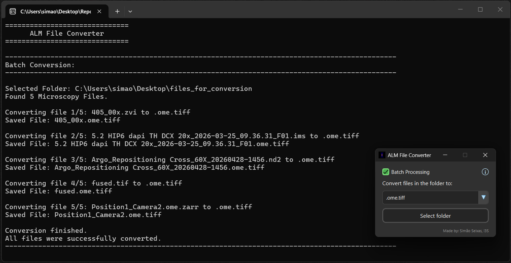

# ALM File Converter

A GUI tool for converting microscopy image files between bioimaging file formats.

A standalone executable is available on the latest Release.

<p align="center">

</p>

## Supported Formats

### Input

`.ims`, `.lif`, `.nd2`, `.zvi`, `.tif`, `.tiff`, `.ome.tif`, `.ome.tiff`, `.zarr`, `.ome.zarr`.

### Output

`.ome.tif`, `.ome.tiff`, `.ome.zarr`, `.tif`, `.tiff`.

<p align="center">

</p>

## How to use

1. Open **ALM File Converter.exe** or run the code through `main.py`.
2. Choose the desired output format.
3. Use **Batch Processing** to convert all microscopy files in a folder.
4. Disable **Batch Processing** to convert a single file.
5. Select the input file or folder.
6. Wait for the conversion to finish.
7. Converted files are saved inside the generated folder: `Converted Files`.

## Features

- Converts single microscopy files or multiple files from a folder in a batch conversion.
- Supports lazy reading to handle large datasets (excluding only `.zvi`).
- Supports multi-position reading in the `.lif` and `.nd2` file formats, given the positions have the same `TCZYX` dimensions.
- Preserves voxel size metadata when available.
- Generates timestamped error reports for failed conversions detailing each failed file and its error traceback information.

### Multi-Position Data

The converter supports multi-position data when the input file has an available position/mosaic axis.

For multi-position outputs:

- `.ome.tif` and `.ome.tiff` store positions as separate series in one file.
- `.tif`, `.tiff`, and `.ome.zarr` save each position as a separate output inside a folder.

### Minor usability features

- The **Batch Processing** check-box and the file format choice box save their state for the next time the program is opened.
- Information about the conversion is displayed in a console window that opens with the program.
- If any error occurs during a batch conversion, the program will skip to the next file. The error will then be saved in the generated report


## Running the code

You will need a Python installation.

This project uses Python 3.10.

**Windows:**

```bat
setup_venv.bat
.venv\Scripts\activate
python src/main.py
```
  

**macOS/Linux:**

```sh
./setup_venv.sh
source .venv/bin/activate
python src/main.py
```


### Building the Executable

To build the standalone executable, run:
```
.\.venv\Scripts\pyinstaller.exe --noconfirm --clean "standalone-executable.spec"
```

To build the folder executable, run:
```
.\.venv\Scripts\pyinstaller.exe --noconfirm --clean "folder-executable.spec"
```


## Author

**Simão Peniche Seixas**

simao.seixas@i3s.up.pt  
simao.peniche.seixas@gmail.com  
i3S - Institute for Research and Innovation in Health
